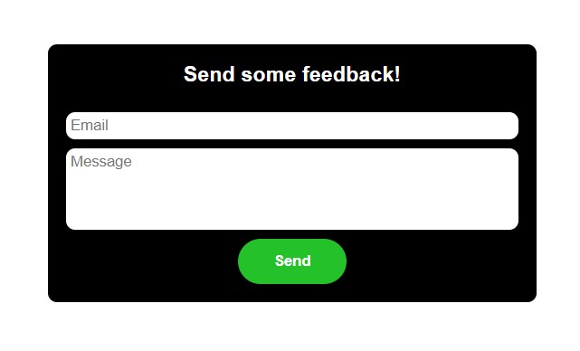
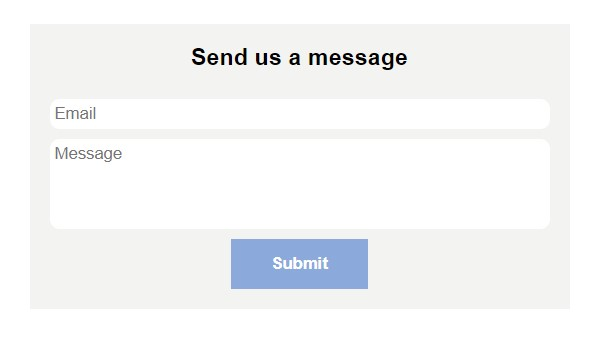

# Vubak
Vubak is a simple Vue component to integrate one-way communication between your app and any Slack channel, and can be used to easily collect user feedback or similar messages from your front end.
It uses Slack's Incoming Webhooks app to transmit messages via a simple HTTP post request, and is simple to add to your Slack channel and set up in minutes. <br />
[Incoming Webhooks](https://api.slack.com/messaging/webhooks)<br />
 <br />

## Installation
```bash
npm install vubak
```
Import the component: 
```
import Vubak from "vubak/Vubak";
```
Then declare it:
```
export default {
  components: {
    Vubak,
  },
...
```
Now you're ready to use it in the template!
```
<Vubak />
```
## Configuration
Vubak relies on the following attributes to set it up and style it: <br />
url: Your url for Incoming Webhooks url, can be found in the app setting in slack. <br />
[https://slack.com/apps/manage](https://slack.com/apps/manage) <br />
title: Title text at the top of the component. <br />
buttonText: Text for submit button. <br />
backgroundStyle/buttonStyle: here you can enter some styling for the component, such as background. 
titleStyle: style for title. <br />
```
<Vuback 
    url="<Your Incoming Webhooks url goes here>" 
    title="Provide some Feedback!" 
    buttonText="Send" 
    backgroundStyle="background-color: black;" 
    buttonStyle="background-color: #25c12b;" 
 />
```
 <br />